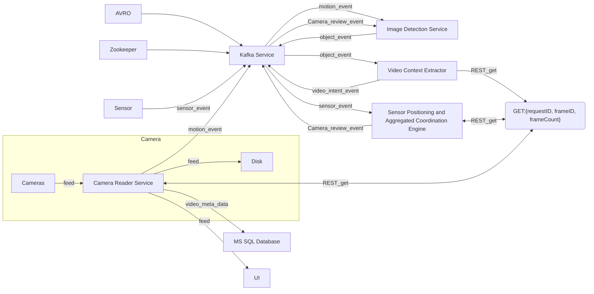

```mermaid
graph LR
    subgraph Camera
        CAM[Cameras]
        CRS[Camera Reader Service]
        DISK[Disk]
    end
    KFK[Kafka Service]
    
    IDS[Image Detection Service]
    DB[MS SQL Database]
    AVRO
    ZOO[Zookeeper]
    WEB[UI]

    VID[Video Context Extractor]

    CAM --> |feed| CRS
    CRS --> |feed| DISK
    CRS --> |motion_event| KFK
    CRS --> |feed| WEB

    CRS --> |video_meta_data| DB
    
    AVRO --> KFK
    ZOO --> KFK
    KFK --> |motion_event| IDS
    KFK --> |object_event| VID


    IDS --> |object_event| KFK


    VID --> |REST_get| PACKET_1("GET:{requestID, frameID, frameCount}") <--> |REST_get| CRS
    VID --> |video_intent_event| KFK


    SPACE[Sensor Positioning and Aggregated Coordination Engine]

    Sensor --> |sensor_event| KFK --> |sensor_event| SPACE <--> |REST_get| PACKET_1
    SPACE --> | Camera_review_event| KFK --> |Camera_review_event|IDS
```
